# Architecture: Mission Readiness & Predictive Maintenance Copilot

> This document reflects the **actual implemented system** as of the current repository state.
> Every component, data flow, and technology claim has been verified against the source code.

---

## System Architecture Diagram

```mermaid
flowchart TD
    subgraph DATA["Data Sources"]
        NASA["NASA C-MAPSS FD001\ntrain_FD001.txt · test_FD001.txt\nRUL_FD001.txt\n(100 turbofan engines, 26 raw cols)"]
        SYN["Synthetic Operational Context\nassets.csv · missions.csv\nmaintenance.csv\n(ENG-001 … ENG-100)"]
    end

    subgraph PIPELINE["Data Pipeline  (src/data/)"]
        LOAD["load_nasa.py\nParse whitespace-separated\nraw text files"]
        SCHEMA["nasa_schema.py\nSingle source of truth:\ncolumns · dtypes · constants\nRoll/delta policy"]
        CLEAN["preprocess_nasa.py  clean()\nDrop constant cols (op3 s1 s5 s10\ns16 s18 s19) · sort (unit, cycle)\nBuild RUL target for train split\nAttach ground-truth RUL for test"]
        FE["feature_engineering.py  add_features()\nPer-engine rolling window W=5:\nmean · std · min · max\n+ cycle delta lag=1\n→ 85 derived features"]
        VAL["validation.py\nDuplicates · nulls · infinites\nunit alignment · target check"]
    end

    subgraph MODELS["ML Models  (src/models/)"]
        direction TB
        HEALTH["Health / Anomaly Model\nisolation_forest_model.joblib\nsklearn IsolationForest\n(N=200, contamination=auto)\n→ anomaly_score → health_score [0-100]\n→ health_status: NORMAL/WARNING/CRITICAL"]
        FAIL["Failure Risk Model\nxgboost_failure_model.joblib\nXGBClassifier\n(N=300, max_depth=6, lr=0.05)\nLabel: RUL ≤ 30 cycles\n→ failure_probability [0,1]\n→ failure_status: LOW/MEDIUM/HIGH"]
        RUL["RUL Model\nrul_model.joblib\nsklearn RandomForestRegressor\n(N=200, RUL cap=125 cycles)\nChronological per-engine split\n→ predicted_rul (cycles)\n→ rul_status: HEALTHY/ADVISORY/CRITICAL"]
    end

    subgraph OUTPUTS["Frozen Model Outputs  (CSV artefacts)"]
        HS["anomaly_scores.csv\nhealth_scores.csv"]
        FS["failure_scores.csv"]
        RS["rul_predictions.csv"]
    end

    subgraph INTEGRATION["Integration Layer  (src/integration/)"]
        BUILD["build_readiness.py\nOrchestration script\npython -m src.integration.build_readiness"]
        ENGINE["readiness_engine.py\nReadinessEngine\nWeighted score:\n0.30 × health + 0.40 × failure + 0.30 × RUL\n→ readiness_score [0-100]\n→ READY / ADVISORY / NOT_READY\n→ maintenance_priority:\nIMMEDIATE / HIGH / MEDIUM / LOW"]
        MISSION["MissionReadiness\nAssign assets to missions\nENG-XXX → numeric ID mapping\nSuitable if readiness_status = READY"]
        ARCSV["asset_readiness.csv\nsrc/data/outputs/\n15 columns · 1 row per asset"]
    end

    subgraph API["REST API  (src/api/  FastAPI + Uvicorn)"]
        MAIN["main.py  port 8000\nGET /assets\nGET /assets/{id}\nGET /assets/{id}/readiness\nGET /assets/{id}/health\nGET /assets/{id}/failure\nGET /assets/{id}/rul\nGET /api/readiness  (fleet)\nGET /api/assets/{id}/timeseries\nGET /maintenance/priorities\nGET /missions/{id}/readiness"]
        ASSESS["assess.py\nPOST /api/assess\nUnseen CSV → validate → clean\n→ add_features → IsolationForest\n→ XGBoost → RandomForest\n→ latest-cycle result per engine"]
    end

    subgraph MCP["Bob MCP Server  (src/api/mcp_server.py)"]
        MCPTOOLS["FastMCP  'Predictive Maintenance'\nTool: get_fleet_readiness()\nTool: get_asset_status(asset_id)\nTool: get_asset_timeseries(asset_id)\nTool: get_maintenance_priorities()\nTool: get_mission_readiness(mission_id)\nRegistered via .bob/mcp.json"]
    end

    subgraph FRONTEND["React Frontend  (src/frontend/  Vite + React 19)"]
        LAND["LandingPage\n/  (home)"]
        MI["MissionIntelligence\n/mission-intelligence\nFetches /api/readiness\nFleet KPI cards · asset list\nRecharts time-series\nReadiness status badge"]
        SA["SensorAssessment\n/sensor-assessment\nCSV upload or manual entry\nPOST /api/assess\nMetric cards · risk explanation\nBob Copilot prompt builder"]
    end

    subgraph BOB["IBM Bob Copilot"]
        BOBUI["Bob Chat Interface\nMCP tools called by Bob\nto answer questions about\nfleet status · readiness\nmaintenance priorities\nmission suitability"]
    end

    subgraph USER["Operator / Analyst"]
        U["User"]
    end

    %% Data ingestion
    NASA --> LOAD
    LOAD --> SCHEMA
    SCHEMA --> CLEAN
    CLEAN --> FE
    FE --> VAL
    VAL --> CLEAN

    %% Model training (offline)
    VAL --> HEALTH
    VAL --> FAIL
    VAL --> RUL

    %% Frozen outputs
    HEALTH --> HS
    FAIL --> FS
    RUL --> RS

    %% Integration
    HS --> BUILD
    FS --> BUILD
    RS --> BUILD
    SYN --> BUILD
    BUILD --> ENGINE
    BUILD --> MISSION
    ENGINE --> ARCSV
    MISSION --> ARCSV

    %% API reads CSV
    ARCSV --> MAIN
    SYN --> MAIN

    %% Assess path
    MAIN --> ASSESS

    %% MCP wraps API
    MAIN --> MCPTOOLS

    %% Frontend calls API
    MAIN --> MI
    MAIN --> SA
    ASSESS --> SA

    %% Bob calls MCP
    MCPTOOLS --> BOBUI

    %% User interactions
    U --> LAND
    U --> MI
    U --> SA
    U --> BOBUI
    BOBUI --> U
    SA --> BOBUI
```



---

## Component Table

| Component | Technology | Responsibility |
|---|---|---|
| **NASA C-MAPSS FD001** | Public turbofan simulation dataset (3 text files) | 20,631 training rows + 13,096 test rows + 100 true RUL values for 100 simulated engines; single source of degradation signal |
| **Synthetic operational data** | Hand-crafted CSV files | `assets.csv` — asset metadata and criticality; `missions.csv` — mission schedule with ENG-XXX identifiers; `maintenance.csv` — maintenance history |
| **nasa_schema.py** | Python constants module | Canonical column names, dtypes, constant-column list, rolling/delta policy; single source of truth consumed by every pipeline stage |
| **load_nasa.py** | Python / Pandas | Parse whitespace-separated raw FD001 text files into DataFrames with typed columns |
| **preprocess_nasa.py + clean()** | Python / Pandas | Drop the 7 constant columns (`op3 s1 s5 s10 s16 s18 s19`), sort by `(unit, cycle)`, build training RUL target (`max_cycle − cycle`), attach ground-truth RUL to test split |
| **feature_engineering.py + add_features()** | Python / Pandas / NumPy | Per-engine backward-looking rolling statistics (mean, std, min, max; window=5) and cycle-delta (lag=1) for each of the 17 surviving base columns → 85 derived features, no future leakage |
| **validation.py** | Python / Pandas | Check duplicates, nulls, infinite values, unit alignment, and target validity; raises on issues |
| **Health / Anomaly model** | scikit-learn `IsolationForest` (N=200, contamination=auto) | Trained on FD001 training data; produces `anomaly_score` (higher = more abnormal); `health_scoring.py` converts to `health_score [0–100]` and `health_status` (NORMAL ≥ 70 / WARNING ≥ 40 / CRITICAL < 40) |
| **Failure Risk model** | XGBoost `XGBClassifier` (N=300, max_depth=6, lr=0.05) | Binary classifier; label = `RUL ≤ 30 cycles`; engine-aware train/val split; produces `failure_probability [0,1]` and `failure_status` (LOW / MEDIUM / HIGH) |
| **RUL model** | scikit-learn `RandomForestRegressor` (N=200, RUL cap=125) | Chronological per-engine split; trained on capped RUL target; predicts `predicted_rul` in cycles and assigns `rul_status` (HEALTHY > 100 / ADVISORY > 30 / CRITICAL ≤ 30) |
| **Frozen model outputs** | CSV files (`anomaly_scores.csv`, `failure_scores.csv`, `rul_predictions.csv`) | Serialised scoring results for all 100 test engines; consumed by the integration layer without re-running inference |
| **readiness_engine.py — ReadinessEngine** | Python / Pandas / NumPy | Merges the three model CSVs by `(asset_id, cycle)`; computes weighted `readiness_score = 100 × (0.30 × health + 0.40 × failure_safety + 0.30 × RUL_norm)`; derives `readiness_status` and `maintenance_priority` |
| **readiness_engine.py — MissionReadiness** | Python / Pandas | Maps `ENG-XXX` → numeric asset ID; evaluates assigned asset; identifies lowest-risk READY asset per mission |
| **build_readiness.py** | Python orchestration script | Offline pipeline runner: load → align → score → save `asset_readiness.csv` (15 columns, 100 rows) |
| **asset_readiness.csv** | CSV flat file | Persistent integration output; the single source of truth consumed by the API at runtime |
| **main.py (FastAPI)** | FastAPI 0.141 + Uvicorn 0.41 | 10 REST endpoints; reads `asset_readiness.csv` into memory with `lru_cache`; joins mission context on demand; CORS open for local dev |
| **assess.py** | Python / FastAPI | `POST /api/assess` — accepts unseen CSV bytes; validates schema; runs `clean → add_features → IsolationForest → XGBoost → RandomForest`; returns latest-cycle assessment per engine |
| **mcp_server.py** | `mcp` library `FastMCP` | Wraps 5 API functions as MCP tools; registered in `.bob/mcp.json` so Bob can call them directly |
| **React frontend** | React 19 + Vite 8 + React Router 7 + Recharts 3 | Three pages: `LandingPage` (marketing), `MissionIntelligence` (fleet dashboard, time-series charts), `SensorAssessment` (CSV upload + manual entry, metric cards, Bob prompt builder) |
| **IBM Bob** | Bob Copilot via MCP | Calls the 5 registered MCP tools to answer natural-language questions about fleet readiness, asset status, maintenance priorities, and mission suitability |

---

## End-to-End Data Flow

### Offline training + integration build (run once)

```
NASA raw text files
  └─ load_nasa.py ──────────────────────────────────── Typed DataFrames
       └─ preprocess_nasa.py (clean + RUL target)
            └─ feature_engineering.py (85 derived features)
                 └─ validation.py (quality gate)
                      ├─ train_anomaly.py ──── IsolationForest ── isolation_forest_model.joblib
                      │                                         └─ anomaly_scores.csv
                      ├─ failure/train.py ───── XGBClassifier ─── xgboost_failure_model.joblib
                      │                                         └─ failure_scores.csv
                      └─ rul/train_rul.py ───── RandomForest ──── rul_model.joblib
                                                                └─ rul_predictions.csv

build_readiness.py
  ├─ Load anomaly_scores.csv ── health_scoring.py ── health_score / health_status
  ├─ Load failure_scores.csv ── failure_risk column
  ├─ Load rul_predictions.csv ─ predicted_rul / rul_status
  └─ ReadinessEngine.calculate()
       └─ readiness_score = 100 × (0.30·health + 0.40·failure_safety + 0.30·RUL_norm)
            └─ readiness_status · maintenance_priority · primary_reason
                 └─ asset_readiness.csv  (100 rows × 15 columns)
```

### Runtime fleet dashboard flow

```
Browser /mission-intelligence
  └─ GET /api/readiness
       └─ _load_readiness() [lru_cache] ── asset_readiness.csv
       └─ join missions.csv (next mission per asset)
            └─ JSON: 100 assets with ENG-XXX IDs, all 15 readiness columns + mission context
                 └─ React: KPI cards (READY / ADVISORY / NOT_READY counts)
                         · Asset list with colour-coded status badges
                         · Recharts time-series on asset select → GET /api/assets/{id}/timeseries
```

### Runtime mission readiness query

```
GET /missions/{mission_id}/readiness
  └─ _load_readiness() + _load_missions()
  └─ MissionReadiness(readiness_df, missions_df)
       └─ normalize ENG-XXX → numeric ID
       └─ assigned_asset_evaluation()
       └─ suitable_assets() ── filter readiness_status = READY
       └─ lowest_risk_asset() ── sort by maintenance_priority_score
            └─ JSON: assigned asset status · suitable count · recommended asset
```

---

## Unseen-Data Inference Flow

The `POST /api/assess` endpoint and the `SensorAssessment` frontend page implement a complete real-time inference path for sensor data that was never seen during training.

```
User action (two input modes)
  ├─ Upload CSV   — drag-and-drop or file picker on /sensor-assessment
  └─ Manual entry — cycle-by-cycle sensor value entry form (17 sensor fields)

CSV requirements
  Full raw    : 26 columns (unit, cycle, op1–op3, s1–s21)
  Cleaned     : 19 columns (unit, cycle, op1, op2, s2–s4, s6–s9, s11–s15, s17, s20–s21)
  Constraint  : ≥ 2 cycles required for rolling/delta features · RUL column forbidden

POST /api/assess (multipart/form-data)
  └─ assess_sensor_data(csv_bytes)
       ├─ 1. pd.read_csv() + lowercase column normalisation
       ├─ 2. _validate_input() — schema match · numeric quality · null/inf check
       ├─ 3. clean() — drop constant columns · sort (unit, cycle)
       ├─ 4. add_features() — rolling + delta features (same as training pipeline)
       ├─ 5. AnomalyDetector.load() ── isolation_forest_model.joblib
       │       └─ anomaly_score → health_score · health_status
       ├─ 6. predict_failure_probability() ── xgboost_failure_model.joblib
       │       └─ failure_probability · failure_status
       ├─ 7. joblib.load(rul_model.joblib)
       │       └─ predicted_rul_cycles
       └─ 8. groupby(unit).cycle.idxmax() — latest cycle per engine
            └─ JSON: unit · cycle · anomaly_score · health_score · health_status
                          · failure_probability · failure_status · predicted_rul_cycles

Frontend post-assessment
  ├─ Metric cards: Health Score · Failure Probability · Predicted RUL · Anomaly Score
  ├─ Risk explanation narrative (buildRiskExplanation)
  ├─ Recharts time-series: full cycle history from GET /api/assets/{id}/timeseries
  └─ "Ask Bob" button — opens Bob modal pre-populated with buildBobContext()
       (structured prompt: all model outputs + limitation disclaimer)
```

---

## Bob Integration and Why It Is Load-Bearing

Bob interacts with the system through a **registered MCP server** (`src/api/mcp_server.py`) that wraps the FastAPI layer. The server is declared in [`.bob/mcp.json`](.bob/mcp.json) and starts automatically when Bob is launched in this workspace.

### Registered tools

| MCP Tool | Maps to API endpoint | What Bob can answer |
|---|---|---|
| `get_fleet_readiness()` | `GET /api/readiness` | "How many assets are ready right now?" "Which engines are in advisory state?" |
| `get_asset_status(asset_id)` | `GET /assets/{id}` | "What is the full readiness record for ENG-047?" |
| `get_asset_timeseries(asset_id)` | `GET /api/assets/{id}/timeseries` | "Show me the health trend for ENG-082 over the last 50 cycles." |
| `get_maintenance_priorities()` | `GET /maintenance/priorities` | "Which assets need immediate maintenance?" "Rank engines by urgency." |
| `get_mission_readiness(mission_id)` | `GET /missions/{id}/readiness` | "Can ENG-047 fly MIS-053?" "What is the best asset to assign to mission MIS-014?" |

### Why this is load-bearing

The MCP integration is not cosmetic. Without it, a user would need to read raw API JSON to understand fleet status. Bob converts the structured ML outputs into plain-English explanations by:

1. Calling `get_fleet_readiness()` to retrieve the 100-asset readiness table and summarising distribution (e.g. "63 READY, 28 ADVISORY, 9 NOT_READY").
2. Calling `get_asset_status()` to ground answers in actual model numbers rather than fabricating them.
3. Receiving the pre-built context string that `SensorAssessment` constructs from `buildBobContext()` — which includes all three model outputs, the cycle range, and an explicit limitations disclaimer — and interpreting it for the operator.
4. Answering mission assignment questions by calling `get_mission_readiness()` and explaining the assigned-asset evaluation and recommended-asset logic.

The `SensorAssessment` page explicitly builds a Bob prompt from inference results and opens the Bob modal, making the human-to-AI handoff a designed UX step rather than an afterthought.

---

## Security Considerations

These are the actual security properties of the running system and the gaps that exist.

| Concern | Current state | Recommended improvement |
|---|---|---|
| **Credential management** | `.env.example` defines variable names; actual `.env` is gitignored. No secrets appear in committed code. | Rotate any credentials from `.env.example` that were used in testing before they were gitignored. |
| **CORS policy** | `allow_origins=["*"]` in `main.py` — fully open | Restrict to the known frontend origin for any non-local deployment. |
| **File upload validation** | `POST /api/assess` enforces `.csv` extension, non-empty body, schema match, numeric-only columns, and forbids RUL as input. | Add a maximum file-size limit to prevent memory exhaustion on large uploads. |
| **Model artefact integrity** | `.joblib` files are loaded directly from disk paths without integrity checks. | Add SHA-256 verification for model artefacts before loading in production. |
| **No authentication** | All endpoints are unauthenticated. | Add API key or token authentication before exposing to any non-local network. |
| **No database** | All data is flat CSV. No SQL injection surface exists. | If a database is added later, use parameterised queries exclusively. |
| **Data sensitivity** | All data is either public (C-MAPSS) or synthetic; no real operational records are present. | Any real HUMS or mission data must be treated as operational-sensitive and access-controlled accordingly. |

---

## Scalability and Future-Extension Considerations

### What the current design handles well

- **Stateless API**: `_load_readiness()` uses `lru_cache(maxsize=1)` so the CSV is read once per process restart; adding a cache-invalidation endpoint (`_invalidate_cache()`) means the data can be refreshed without a restart.
- **Model/data separation**: Model artefacts (`.joblib`) and integration outputs (`asset_readiness.csv`) are completely decoupled. The API never retrain models; inference and serving are separated.
- **Schema contract**: `nasa_schema.py` is the single source of truth. Any pipeline component that needs column definitions imports from it, so adding a new feature set requires a single-file change.
- **MCP extensibility**: New API endpoints can be exposed to Bob by adding a decorated function to `mcp_server.py` — no Bob-side changes needed.

### Natural extension points

| Extension | What to add |
|---|---|
| **SHAP explanations** | Add `shap` library; call `shap.TreeExplainer` on the XGBoost and RandomForest models in `assess.py` and the integration layer; expose per-feature contribution via a new `/api/assets/{id}/shap` endpoint and a new MCP tool. |
| **Streaming / real-time sensor data** | Replace CSV ingestion with a message queue consumer (e.g. Kafka); `assess_sensor_data()` already handles arbitrary multi-cycle windows and could be called per-message batch. |
| **Model versioning** | Replace hard-coded `.joblib` path constants with a model registry lookup (MLflow, or a simple manifest JSON); `AnomalyDetector.load()` already accepts an optional path override. |
| **Additional C-MAPSS operating conditions** | The schema is parameterised by `CONSTANT_COLUMNS`; FD002–FD004 use different constant sets and can be added by extending the schema without rewriting the pipeline. |
| **Persistent storage** | Replace `asset_readiness.csv` reads with a lightweight database (SQLite for single-node; PostgreSQL for multi-node); the `_load_readiness()` / `_load_missions()` pattern can be swapped out behind the same function signatures. |
| **Containerisation** | The API and MCP server have no OS-specific dependencies and can be wrapped in a single `Dockerfile` with `uvicorn src.api.main:app` as the entrypoint; the frontend builds to static assets (`dist/`) that can be served by Nginx. |

---

## Known Gaps Between Documentation and Code

The following discrepancies existed in the previous version of this document and have been corrected:

1. **RUL model algorithm**: Documentation and `submission.yaml` described an "XGBoost regressor" but the actual trained model (`rul_model.joblib`) is a `sklearn.ensemble.RandomForestRegressor`.
2. **SHAP**: Listed as a feature in `submission.yaml` and the old architecture diagram. No SHAP code exists anywhere in the repository. The feature is absent, not planned.
3. **Entire system status**: The old `architecture.md` stated "No pipeline, model, API, dashboard, or database is currently implemented." The repository contains a complete end-to-end implementation: trained models, FastAPI backend, MCP server, and React frontend.
4. **Database**: `.env.example` mentions `DATABASE_URL` (PostgreSQL). No database is used; all persistence is flat CSV.
5. **watsonx**: `.env.example` references `WATSONX_API_KEY`. No watsonx code exists in the repository.
