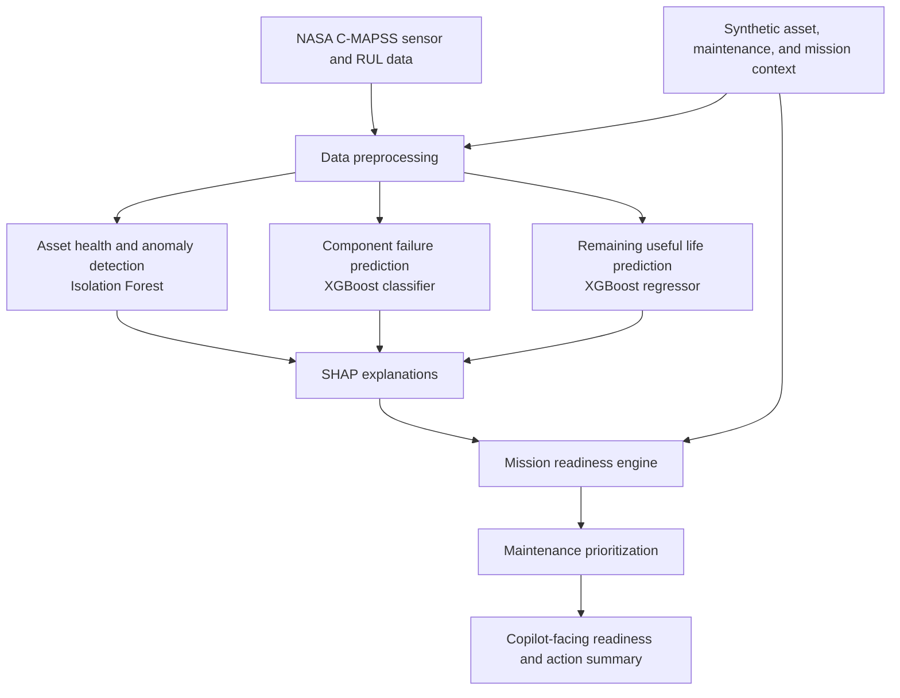

# Architecture: Proposed Mission Readiness Copilot

## System Architecture

The diagram describes the proposed analytical architecture. No pipeline, model,
API, dashboard, or database is currently implemented in this repository.

## Components

| Component                    | Technology                         | Responsibility                                                                                      |
| ---------------------------- | ---------------------------------- | --------------------------------------------------------------------------------------------------- |
| NASA C-MAPSS data            | Public turbofan simulation dataset | Initial real source for sensor/degradation and RUL information; FD001 is the initial focus.         |
| Supporting operational data  | Synthetic, planned                 | Asset metadata, maintenance/service history, mission schedule, and criticality.                     |
| Preprocessing                | Planned Python data workflow       | Align time/cycle observations, validate inputs, and prevent temporal leakage.                       |
| Asset health                 | Planned Isolation Forest           | Produce an anomaly signal for unusual asset behavior.                                               |
| Failure risk                 | Planned XGBoost classifier         | Estimate component failure probability over a defined future horizon.                               |
| RUL                          | Planned XGBoost regressor          | Estimate remaining useful life and compare it with mission timing.                                  |
| Explainability               | Planned SHAP                       | Describe feature contributions to risk and RUL outputs.                                             |
| Readiness and prioritization | Planned decision layer             | Combine predictions with mission context and criticality into conceptual labels and action ranking. |

## Data Flow

The intended end-to-end flow is:

1. Load NASA C-MAPSS observations and RUL information, then associate them conceptually with synthetic operational records through `asset_id` and time/cycle context.
2. Validate and transform time-ordered features without using future maintenance or failure information for an earlier prediction.
3. Generate anomaly, failure-risk, and RUL outputs with the planned models.
4. Generate human-readable SHAP explanations for the model outputs.
5. Combine outputs with mission timing, criticality, and maintenance history to support conceptual readiness labels such as Mission Ready, At Risk, Maintenance Required, and Not Mission Ready.
6. Present prioritized maintenance actions through a future copilot interface.

## Security Considerations

Because no application is implemented, these are design requirements for a future
implementation rather than verified controls.

- Keep credentials and connection strings outside source control.
- Restrict access to operational records and avoid exposing sensitive asset or mission details in explanations.
- Preserve dataset provenance and distinguish public C-MAPSS data from synthetic supporting data.
- Audit model inputs, prediction time, model version, and recommendation rationale.

## Scalability Notes

Future scaling would require an orchestrated batch or streaming data workflow,
versioned models, reproducible feature computation, monitoring for drift, and an
access-controlled serving layer. No scalability or performance result is claimed
for the current documentation-only repository.
